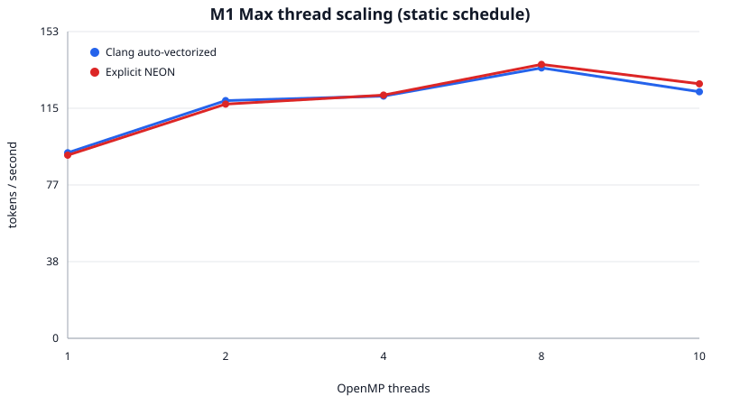

# llama2.c Performance Engineering on a 16-inch M1 Max MacBook Pro

[](https://github.com/NewbCrescent/llama2c-m1-max-performance/actions/workflows/ci.yml)

An Apple Silicon performance-engineering study built on Andrej Karpathy's
[llama2.c](https://github.com/karpathy/llama2.c). The project asks a narrower
question than “how fast can Llama run?”: which compiler, SIMD, scheduling, and
threading decisions actually improve this small C inference engine on an M1 Max?

I did **not** write the original model, tokenizer, training code, or inference
engine. This repository is a transparent GitHub fork of `llama2.c`; my work is
the experimental method, Apple Silicon build variants, explicit ARM NEON kernel,
benchmark harness, measurements, and analysis.

## Result

On a 10-core Apple M1 Max (8 performance + 2 efficiency cores), the best
auto-vectorized configuration reached a median **135.19 tok/s**, or **14.30x**
the standards-conforming `-O3` single-thread baseline of **9.45 tok/s**, on the
110M TinyStories model.

| Configuration | Threads | Schedule | Median tok/s | Speedup |
|---|---:|---|---:|---:|
| Clang `-O3` baseline | 1 | — | 9.45 | 1.00x |
| Clang fast-math | 1 | — | 95.74 | 10.13x |
| Fast-math + OpenMP | 8 | static | 135.19 | 14.30x |
| Fast-math + OpenMP | 10 | static | 123.29 | 13.05x |
| Explicit NEON + OpenMP | 8 | static | 136.96 | 14.49x |

The explicit NEON median was 1.3% above Clang's auto-vectorized median, but its
trial-to-trial standard deviation was 4.86 tok/s versus 2.04 tok/s for Clang.
That difference is smaller than the observed run variance, so the defensible
conclusion is **no clear manual-NEON win**, not “NEON is faster.”



The full [summary](benchmarks/results/m1-max-110m/README.md),
[raw trials](benchmarks/results/m1-max-110m/raw.json), and
[CSV](benchmarks/results/m1-max-110m/summary.csv) are checked in.

## What the investigation found

### Floating-point semantics mattered more than adding threads

The largest gain came from allowing reassociation of floating-point reductions.
At strict `-O3`, Clang vectorized the multiplications in the hot matrix-vector
loop but extracted lanes and accumulated 20 scalar additions in program order.
With `-ffast-math`, it emitted independent ARM vector FMA accumulators and
reduced them after the loop. That changed single-thread throughput from 9.45 to
95.74 tok/s.

This is a real optimization with a real tradeoff: `-ffast-math` relaxes IEEE
floating-point semantics. All measured variants produced byte-identical greedy
output for this benchmark, but that one test does not prove numerical
equivalence for every model and prompt. See the generated
[vectorization report](docs/vectorization.md) for compiler diagnostics and
assembly excerpts.

### Manual SIMD was not meaningfully faster

The explicit kernel uses eight NEON `float32x4_t` accumulators and FMA intrinsics.
It was dramatically faster than strict floating-point code, but that is the
wrong comparison: Clang needs the same reassociation freedom to generate an
equivalent reduction. Under identical fast-math and OpenMP flags, manual NEON
and compiler-generated SIMD performed about the same. The scalar source is
simpler and portable, so it remains the preferred implementation.

### More cores were not always better

Static scheduling scaled to 8 threads, then fell from 135.19 tok/s at 8 threads
to 123.29 tok/s at 10. macOS reports this chip as 8 performance and 2 efficiency
cores. The result is consistent with the last two workers becoming stragglers
on the efficiency cores, but this benchmark did not pin threads or record which
core ran each worker, so it does not prove that mechanism.

### Scheduling overhead was visible

At 8 threads, median throughput was 135.19 tok/s with static scheduling, 122.81
tok/s with guided scheduling, and 70.00 tok/s with default fine-grained dynamic
scheduling. The matmul rows have uniform work, so dynamic work distribution adds
overhead without solving a meaningful load imbalance.

## Reproduce the benchmark

The published run used macOS 26.6.2, Homebrew Clang 23.1.0, 64 GB memory, and
Karpathy's 110M TinyStories float32 checkpoint. Model files are intentionally not
stored in Git.

```bash
brew install llvm libomp
curl -L https://huggingface.co/karpathy/tinyllamas/resolve/main/stories110M.bin \
  -o stories110M.bin

python3 benchmarks/run_benchmarks.py \
  --model stories110M.bin \
  --steps 64 \
  --warmups 1 \
  --repetitions 5 \
  --threads 1,2,4,8,10 \
  --schedules static,dynamic,guided \
  --output benchmark-results/local
```

The harness:

- compiles every variant with the same Clang installation;
- uses deterministic greedy decoding (`temperature=0`, seed 42);
- warms each configuration once;
- measures five round-robin trials to distribute temperature/background drift;
- reports median, mean, standard deviation, minimum, and maximum throughput;
- hashes generated output and records compiler, machine, model, tokenizer, and
  exact build-command metadata; and
- generates CSV, JSON, Markdown, and an SVG thread-scaling chart using only the
  Python standard library.

The checkpoint used for the checked-in results has SHA-256
`515267168726a1ed1317a64a408492e6af3b67c1f71c5bd98c01d9d721803a24`.

## Build variants directly

```bash
make run       # ./run: strict -O3 baseline
make runfast   # ./run-fast: -O3 -ffast-math, single-threaded
make runomp    # ./run-omp: fast-math + OpenMP, compiler-generated SIMD
make runneon   # ./run-neon: fast-math + OpenMP + explicit ARM NEON
```

For example:

```bash
OMP_NUM_THREADS=8 OMP_SCHEDULE=static \
  ./run-omp stories110M.bin -t 0 -s 42 -n 64
```

To regenerate the compiler analysis:

```bash
python3 benchmarks/inspect_vectorization.py
```

## Project map

- `run.c` — upstream inference implementation plus opt-in scheduling and NEON
  variants in the hot matmul kernel.
- `benchmarks/run_benchmarks.py` — build, execution, validation, statistics, and
  chart harness.
- `benchmarks/inspect_vectorization.py` — reproducible Clang diagnostics and
  assembly inspection.
- `benchmarks/results/m1-max-110m/` — checked-in raw and summarized evidence.
- `docs/legacy-microbenchmark.md` — why the original synthetic 8.52x result is
  not used as an inference claim.

The rest of the repository is inherited from `llama2.c`, including quantized
inference, Python training/export utilities, tests, and tokenizer assets.

## Limitations

- Results characterize one M1 Max, compiler version, model, prompt/seed, and
  short generation length; they are not general CPU or Llama benchmarks.
- The original timer excludes the first token and uses millisecond resolution.
  Repeated 64-token trials reduce, but do not eliminate, measurement noise.
- CPU frequency, thermals, and background activity were not locked down.
- No thread affinity was set, so the performance/efficiency-core explanation is
  a supported hypothesis rather than a directly observed assignment trace.
- Fast-math changes floating-point semantics even though this run's text hashes
  matched across every configuration.

## Attribution and license

This performance study is based on [`karpathy/llama2.c`](https://github.com/karpathy/llama2.c)
at upstream commit `350e04f`. The upstream project and this fork are distributed
under the [MIT License](LICENSE); the original copyright notice is preserved.

The TinyStories models and original architecture/training discussion belong to
the upstream project. This fork's commit history separates the inherited code
from the Apple Silicon experiments and subsequent reproducibility cleanup.
